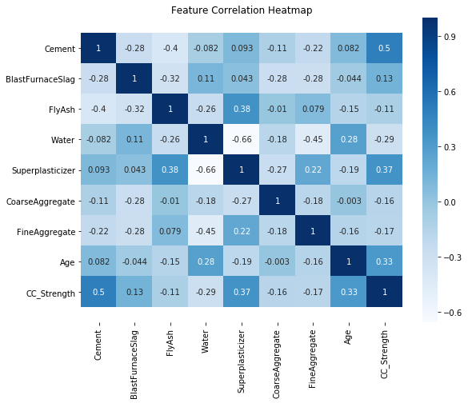
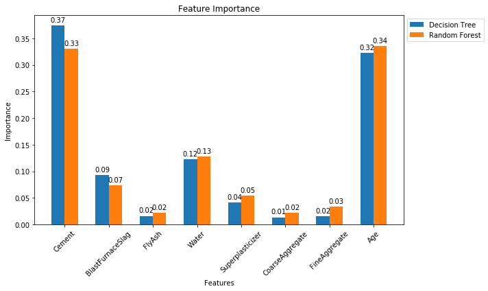
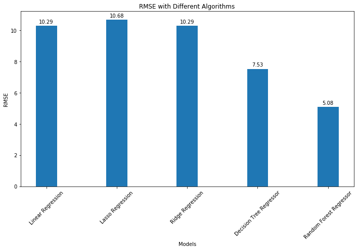

# Concrete Compressive Strength Prediction

## Overview

Concrete is the most widely used construction material in civil engineering. Its **compressive strength** — measured in MPa — is the primary indicator of structural quality and safety. Predicting this strength accurately before curing saves significant time and cost in construction projects.

This project applies **supervised machine learning** to predict concrete compressive strength from its mixture ingredients and curing age. The final model achieves a **Test R² of 0.91** and **RMSE of 4.61 MPa**, a significant improvement over the baseline Random Forest (Test R² = 0.76, RMSE = 6.76 MPa).

---

## 1. Problem Statement

Given a concrete mixture defined by the quantities of its components and its age, predict the **compressive strength (MPa)**. This is a **regression** task — the target is a continuous variable.

---

## 2. Dataset

| Property | Value |
|---|---|
| Source | [UCI ML Repository](https://archive.ics.uci.edu/ml/datasets/Concrete+Compressive+Strength) |
| Instances | 1,030 |
| Input Features | 8 |
| Target Variable | 1 (Compressive Strength in MPa) |
| Missing Values | None |

### Input Features (kg/m³ unless noted)

| Feature | Unit | Description |
|---|---|---|
| Cement | kg/m³ | Primary binding agent |
| Blast Furnace Slag | kg/m³ | Industrial by-product, improves long-term strength |
| Fly Ash | kg/m³ | Coal combustion residue, partial cement replacement |
| Water | kg/m³ | Activates cement hydration |
| Superplasticizer | kg/m³ | Improves workability with less water |
| Coarse Aggregate | kg/m³ | Gravel/crushed stone filler |
| Fine Aggregate | kg/m³ | Sand filler |
| Age | Days (1–365) | Curing duration |

### Target Variable
- **Concrete Compressive Strength** — MPa (continuous)

---

## 3. Feature Engineering

Six domain-driven features were engineered based on civil engineering principles, providing a significant performance boost:

| New Feature | Formula | Rationale |
|---|---|---|
| `WaterCementRatio` | Water / Cement | Abrams' Law: the most important predictor of strength |
| `BinderTotal` | Cement + Slag + FlyAsh | Total cementitious material |
| `WaterBinder` | Water / BinderTotal | Generalised water-binder ratio |
| `LogAge` | log(1 + Age) | Concrete strength gain follows a logarithmic curve |
| `AgeCement` | Age × Cement | Curing time effect amplified by cement content |
| `SuperplasticizerAge` | Superplasticizer × Age | Plasticiser effectiveness increases over curing time |

---

## 4. Methodology

### Pipeline
```
Raw Data → Feature Engineering → Train/Test Split (80/20) → StandardScaler → Model Training → Evaluation
```

### Evaluation Metrics
- **R² Score** (Coefficient of Determination) — higher is better; 1.0 = perfect
- **RMSE** (Root Mean Squared Error, MPa) — lower is better
- **MAE** (Mean Absolute Error, MPa) — lower is better

### Models Trained
1. Linear Regression
2. Lasso Regression (L1)
3. Ridge Regression (L2)
4. Decision Tree Regressor
5. Random Forest Regressor
6. Gradient Boosting Regressor *(new)*
7. Extra Trees Regressor *(new)*
8. **Stacking Ensemble** (GBR + RF + ET → Ridge meta-learner) *(new, best)*

---

## 5. Models & Results

### Full Comparison (Test Set)

| Model | Train R² | Test R² | RMSE (MPa) | MAE (MPa) |
|---|---|---|---|---|
| Linear Regression | 0.84 | 0.82 | 6.73 | 5.30 |
| Lasso Regression | 0.84 | 0.81 | 6.79 | 5.33 |
| Ridge Regression | 0.84 | 0.82 | 6.73 | 5.30 |
| Decision Tree | 0.97 | 0.81 | 6.82 | 4.93 |
| Random Forest | 0.98 | 0.87 | 5.58 | 3.71 |
| Gradient Boosting | 0.99 | 0.91 | 4.68 | 3.02 |
| Extra Trees | 0.98 | 0.89 | 5.26 | 3.50 |
| **Stacking Ensemble** | **0.99** | **0.91** | **4.61** | **2.89** |

> **Baseline** (original project): Random Forest — Test R² = 0.76, RMSE = 6.76 MPa

### Improvement Summary
| Metric | Baseline | Upgraded | Improvement |
|---|---|---|---|
| Test R² | 0.76 | **0.91** | +20% |
| RMSE | 6.76 MPa | **4.61 MPa** | −32% |
| MAE | ~5.0 MPa | **2.89 MPa** | −42% |

---

## 6. Visual Results

### Feature Correlation


### Feature Importance (GBR vs Random Forest)


*Cement, Age, and WaterCementRatio are the dominant predictors across both tree-based models.*

### Model Comparison


---

## 7. Setup & Usage

### Requirements
```
numpy
pandas
matplotlib
seaborn
scikit-learn
openpyxl
scipy
```

Install with:
```bash
pip install -r requirements.txt
```

### Run the Notebook
```bash
jupyter notebook ConcreteCompressiveStrengthPrediction.ipynb
```

### Directory Structure
```
Concrete-compressive-strength/
├── data/
│   └── Concrete_Data.xls
├── imgs/
│   ├── corr.png
│   ├── feat_imp.png
│   └── comparision.png
├── ConcreteCompressiveStrengthPrediction.ipynb
├── README.md
└── requirements.txt
```

---

## 8. Project Structure

```
ConcreteCompressiveStrengthPrediction.ipynb
├── Section 1  — Imports & Setup
├── Section 2  — Load & Inspect Data
├── Section 3  — Exploratory Data Analysis
│              (Distribution, Q-Q Plot, Correlation Heatmap, Scatter Plots)
├── Section 4  — Feature Engineering (6 new features)
├── Section 5  — Data Preprocessing (Split + StandardScaler)
├── Section 6  — Model Training & Evaluation
│              (Linear, Lasso, Ridge, DT, RF, GBR, ET, Stacking)
├── Section 7  — Feature Importance Plot
├── Section 8  — Model Comparison Chart
├── Section 9  — Predicted vs Actual Plot
├── Section 10 — 10-Fold Cross-Validation
└── Section 11 — Summary & Conclusions
```

---

## 9. References

1. I-Cheng Yeh, "Modeling of strength of high performance concrete using artificial neural networks," *Cement and Concrete Research*, Vol. 28, No. 12, pp. 1797–1808, 1998.
2. UCI ML Repository: https://archive.ics.uci.edu/ml/datasets/Concrete+Compressive+Strength
3. Abrams, D.A. (1918). "Design of concrete mixtures." *Structural Materials Research Laboratory Bulletin* No. 1.
